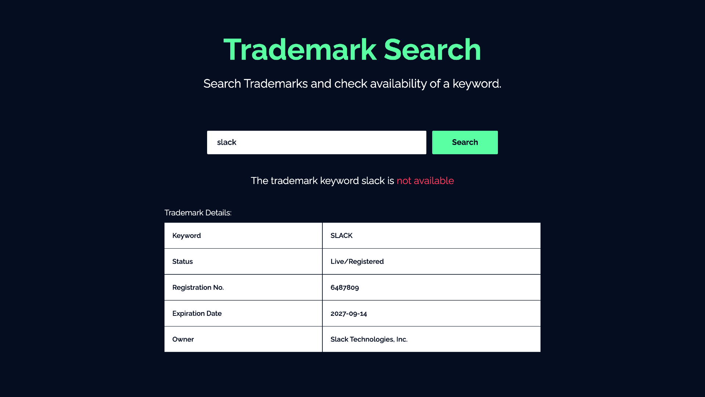

<div align="center">
	<h2>Trademark App</h2>
</div>

### ⚡️ Features

- Search trademarks.
- Check availibility of a trademark keyword.

### 🛠️ Installation Steps

1. Download the `trademark-app` directory. Click [here](https://github.com/92EPk/trademark-api/archive/refs/heads/master.zip) to download it.

2. Unzip the downloaded file and enter the working directory.

```bash
cd trademark-app/
```

3. Install dependencies

```bash
npm install
```

4. Create `.env.local` file in root and add your RapidAPI key.

```bash
NEXT_PUBLIC_RAPIDAPI_KEY=YOUR_RAPID_API_KEY
```

5. Run the app

```bash
npm run dev
```

almost done! now Open [localhost:3000](http://localhost:3000/) to see the app.
